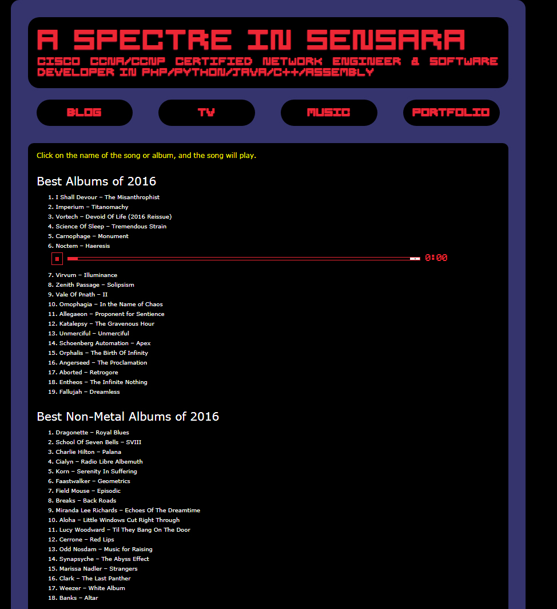
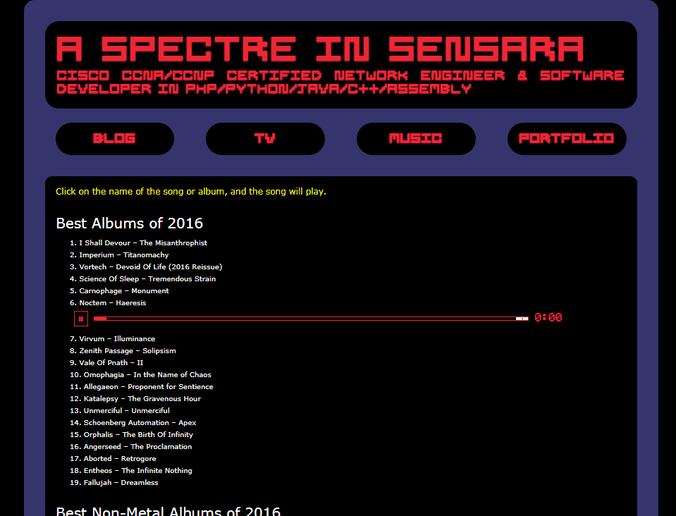

# My Wordpress Site

I made the entire design of my Wordpress site at www.newpaltzartist.com/wordpress, and voluminous plugins & themes for myself and other satisfied clients.  In addition to Cloud Computing & Networking, I am skilled in Wordpress in addition to Magento (I got my Magento certification in 2013). Full Stack Web Development was my former occupation.

# Music Page

I made a separate page that lists my favorite songs & albums in order in 2016, using the Custom Post Types plugin & Advanced Custom Fields plugin. I added a lot to it, including the capacity to play music by the song someone entered in the administration. Unfortunately, the API has changed and broke, and I'm not going to fix it unless somebody really wants it.

# Draggable Functionality (admin_category_move.php) 

I simply added to "Intuitive Custom Post Order" by hijiji to do something important when a user drags one of the row. In this case, it was to change the rating of an album or a song. Hijiji did all the work.

